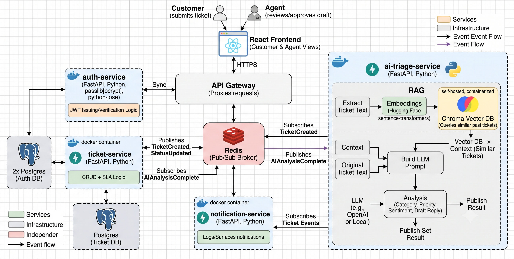

<div align="center">

# 🚀 Resolvix AI

### AI-Powered Customer Support Platform built with Microservices, RAG & LLMs

An intelligent customer support platform that automatically analyzes support tickets, retrieves similar historical cases using Retrieval-Augmented Generation (RAG), and generates contextual AI-powered response suggestions.

<p>


</p>

</div>

---

# 📖 Overview

Resolvix AI is a production-style AI-powered customer support platform designed using a **microservices architecture**.

The system automatically analyzes incoming support tickets using **Retrieval-Augmented Generation (RAG)** and **Large Language Models (LLMs)** to:

- 🎫 Categorize tickets
- 🚨 Predict ticket priority
- 😊 Detect customer sentiment
- 🔍 Retrieve similar historical tickets
- 💬 Generate contextual AI reply suggestions

The platform follows an **event-driven architecture** where services communicate asynchronously through **Redis Pub/Sub**, making the system scalable and loosely coupled.

---

# 🏗️ System Architecture

> Replace the image below with your architecture diagram.

<p align="center">

</p>

---

# ✨ Features

## Authentication

- JWT Authentication
- User Registration & Login
- Role-Based Authorization

## Ticket Management

- Create Support Tickets
- Dashboard
- Ticket Details
- Ticket Tracking

## AI Ticket Triage

- Automatic Ticket Classification
- Priority Detection
- Sentiment Analysis
- Context Retrieval using RAG
- AI Generated Reply Suggestions

## Architecture

- Microservices
- API Gateway
- Redis Pub/Sub
- Event-Driven Processing
- Dockerized Services
- PostgreSQL
- Chroma Vector Database

---

# ⚡ System Workflow

```text
Customer
    │
    ▼
Next.js Frontend
    │
    ▼
API Gateway
    │
    ▼
Ticket Service
    │
    ▼
PostgreSQL
    │
    ▼
Redis Pub/Sub
    │
    ▼
AI Triage Service
    │
    ├── HuggingFace Embeddings
    ├── Chroma Vector Database
    └── Groq LLM
    │
    ▼
Redis
    │
    ▼
Ticket Service
    │
    ▼
Frontend Updates
```

---

# 🏛️ Microservices

| Service | Responsibility |
|----------|----------------|
| API Gateway | Entry point for all client requests |
| Auth Service | Authentication & JWT |
| Ticket Service | Ticket CRUD operations |
| AI Triage Service | AI Analysis using RAG & LLM |
| Notification Service | Event notifications |

---

# 🧠 AI Pipeline

```text
Ticket Created
      │
      ▼
Generate Embeddings
      │
      ▼
Retrieve Similar Tickets
      │
      ▼
Construct Prompt
      │
      ▼
Groq LLM
      │
      ▼
Category
Priority
Sentiment
Suggested Reply
```

---

# 🛠️ Tech Stack

## Frontend

- Next.js
- React
- TypeScript
- Tailwind CSS

## Backend

- FastAPI
- Python
- SQLAlchemy
- JWT Authentication

## AI

- Groq LLM
- Hugging Face Embeddings
- Chroma Vector Database
- Retrieval-Augmented Generation (RAG)

## Infrastructure

- PostgreSQL
- Redis
- Docker
- Docker Compose

---

# 📂 Project Structure

```text
Resolvix-AI
│
├── frontend
├── auth-service
├── ticket-service
├── ai-triage-service
├── notification-service
├── api-gateway
│
├── docker-compose.yml
├── ARCHITECTURE.md
└── README.md
```

---


# 🚀 Getting Started

Clone the repository

```bash
git clone https://github.com/cl0ud08/Resolvix-AI.git

cd Resolvix-AI
```

Create environment variables for each service.

Example

```env
DATABASE_URL=
REDIS_URL=
JWT_SECRET=
GROQ_API_KEY=
```

Run

```bash
docker-compose up --build
```

---

# 🎯 Future Enhancements

- Agent Assignment
- Email Notifications
- Slack Integration
- Kubernetes Deployment
- CI/CD Pipeline
- Monitoring with Prometheus & Grafana
- Multi-tenant Support
- OAuth Login

---

# 📚 Key Concepts Demonstrated

- Microservices Architecture
- Event-Driven Systems
- API Gateway Pattern
- JWT Authentication
- Retrieval-Augmented Generation (RAG)
- Vector Databases
- Semantic Search
- Redis Pub/Sub
- Asynchronous Processing
- Dockerized Deployment
- AI-powered Ticket Triage

---

# 👨‍💻 Author

**Harshit Gupta**

AI/ML Engineer • Backend Developer • Full Stack Developer

- GitHub: https://github.com/cl0ud08
- X: https://x.com/0xhrshit
---

<div align="center">

### ⭐ If you found this project useful, consider giving it a star!

</div>
